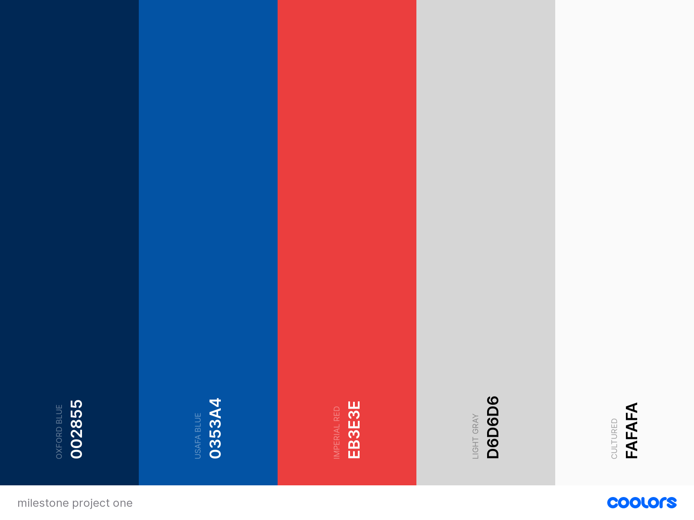

# Arist Page - SAWYL

## Goals for project
Every modern artist needs to have an online presence. It is a fantastic way to keep fans up to date with your work, whether it be new music, tour dates, or merchandise. It can also be a great way for fans, or potential clients, to get in touch.

Here I have created a web page for the fictional artist "SAWYL". This is a place for this artist to display all of their music, merchandise and tour dates; along with a contact form for any fans or clients to get in touch.

Thank you for visiting my project - if you have any questions please feel to contact me via my GitHub contact details.

## Table of contents
- UX
    - User goals
    - User stories
    - Site owner's goals
    - Design choices
        - Fonts
            - Roboto Condensed
            - Cabin
        - Colours
            - Accessibility
        - Structure
- Wireframes
    - Wireframes
- Features
- Technologies used
    - Languages
    - Libraries
    - Tools
- Bugs
- Deployment
    - GitHub Pages
- Credits
## UX
### User Goals
- The website must be responsive, working on a range of screen sizes (desktop, tablet, phones, etc.).
- To be able to easily find out about the artist's latest releases, tour dates, and merchandise.
- I wanted to have a clear flow of information on the page.

### User Stories
- As a user, I want to be able to access the artist's discography
- As a user, I want to be able to access the artist's merchandise easily.
- As a user, I would like to see the artist's upcoming tour dates easily.
- As a user, I would like to be able to get in contact with the artist - including links to social media.
- As a user, I want to to be able to access this website on different devices.

### Site Owner's Goals
- To have a visually appealing website that allows users to keep up to date with the artist.
- For the website to have give the user a positive experience, with all functionality working smoothly.
- For all the information to be contained within one page, with easily navigable sections.
- For the website to reflect the artist, so that any users who visit the site have a clear idea of the artist's style.

### User Requirements and Expectations
**Requirements**
- To have an easily navigable page, using only a few nav buttons.
- When nav buttons are clicked, the page should smoothly scroll to the appropriate section.
- For each section to have a clear title that demarcates the section's purpose.
- For all of the site's links to be functional.

**Expectations**
- For the page to have a clear flow of information.
- For all links to external sites should open in a new tab.
- To have a visually appealing page.
- For the page to reflect the style of the artist.

### Design choices

I used [Coolors](https://coolors.co/) to create my colour scheme. The artist's style of music is slow and melancholy - I wanted this to be reflected through the colour choices. I used hues of blue and white for the majority of the page, to evoke feelings of coldness. However, I did contrast this colour by adding in red sparsely to highlight the artist's tour dates - the artist expressed their desire to expand their ticket sales, so I wanted to choose a colour that demanded attention.

Below, I will go into my colour selection more thoroughly.

- #002855: I decided to use this colour as the main background for the page as I felt this cold hue was inkeeping with the artist's style.
- #0353A4: This colour was used for the page's buttons. I felt that it was inkeeping enough with the overall style of the page, while being different enough from the background as to clearly highlight all buttons.
- #EB3E3E: The artist expressed interest in directing people toward their tour dates, to achieve this I used red to contrast from the background. Also, I felt that this colour paired well with the image displayed in the tour section.
- #D6D6D6: I used this colour for the hover effects on all icons - I felt that it was dark enough to clearly show the user that they had highlighted the current icon.
- #FAFAFA: This culture was used for all of the text on the page. I checked the colour contrast of this colour against the background colour using [WebAIM Contrast Checker](https://webaim.org/resources/contrastchecker/) - which returned a contrast ratio of 14.02:1, which complies with the WCAG AAA requirements (which is 7:1).

**Fonts**

I used [Google Fonts](https://fonts.google.com/) to select the page's fonts. For the page titles, I used [Roboto Condensed](https://fonts.google.com/specimen/Roboto+Condensed?query=roboto+cond) and for all other text, I used [Cabin](https://fonts.google.com/specimen/Cabin?query=cabin). I found this font pairing on [Font Pair](https://www.fontpair.co/).

## Wireframes

I created the following wireframes using [Figma](https://www.figma.com)

These wireframes demonstrate how to the information displayed varies across screen sizes - including any potential hidden content.

#### Desktop Wireframes
- [Main section](wireframes/desktop-main.png)
- [Discography](wireframes/desktop-discography.png)
- [Tour](wireframes/desktop-tour.png)
- [Shop](wireframes/desktop-shop.png)
- [Contact](wireframes/desktop-contact.png)

#### Tablet Wireframes
- [Main section](wireframes/tablet-main.png)
- [Discography](wireframes/tablet-discography.png)
- [Tour](wireframes/tablet-tour.png)
- [Shop](wireframes/tablet-shop.png)
- [Contact](wireframes/tablet-contact.png)

#### Mobile Wireframes
- [Main section](wireframes/phone-main.png)
- [Discography](wireframes/phone-discography.png)
- [Tour](wireframes/phone-tour.png)
- [Shop](wireframes/phone-shop.png)
- [Contact](wireframes/phone-contact.png)

## Features

### Existing Features
- Smooth scroll functionality from nav menu.

### Features to be implemented
- To allow users to click on different images in the shop sections to go directly to the different categories within the shop.
- To have an audio player on each album card to play a demo of each album.
- When a user visits the site, the tour date that is closest to them geographically should be highlighted in a different colour.

## Technologies used
### Languages
- [HTML](https://developer.mozilla.org/en-US/docs/Web/HTML)
- [CSS](https://developer.mozilla.org/en-US/docs/Web/CSS)

### Frameworks
- [Bootstrap](https://getbootstrap.com/)

## Testing
 
 ### **Access to Artist's Discography**

 **User Story: As a user, I want to be able to access the artist's discography.**
 - **Plan**
 I want to create three sections on the page in which the user can be redirected to the artist's discography: either to their latest album in the main section (at the top of the page), to a selection of featured album (in the discography section), or to the remainder of their music in the shop section - within each of these sections, I will add either a button or icon that will lead them to the artist's discography when clicked.

 - **Implementation**
 In each of these sections, I included links that leads to the artist's music in a different ways: the main section and discography section give the user options to either stream the artist's music by taking them to Spotify, or to buy the album directly from Bandcamp; then, in the shop section, the link takes the user to the artist's Big Cartel page.

 - **Test**
 I went through all of the possible links that could lead to the artist's discography and clicked them five times to ensure that they took the user to the correct page consistently.

 - **Result**
 All of the links took me to the appropriate page when clicked each time.

 - **Verdict**
 This test passed all success criteria.
 
 ### **Access to Merchandise**
 **As a user, I want to be able to access the artist's merchandise easily.**

 - **Plan**
 I want the user to be able to be redirected to the artist's external merchandise store on Big Cartel when they click on the 'Shop Now' button in the shop section.
 
 - **Implementation**
 In the shop section of the website, I added a clear 'Shop Now' button which includes a link to the Big Cartel page (which opens in a new tab).

 - **Test**
 I clicked this link as part of the test above ('Access to Artist's Discography') - I clicked the 'Shop Now' button five times in this test to ensure I was redirected to the correct page without issue.

 - **Result**
 I was taken to the correct web page (Big Cartel) on all five occaisons.

 - **Verdict**
 This test has been successful.

 ### **Tour Dates Visibility**
 **As a user, I would like to see the artist's upcoming tour dates easily.**

 - **Plan**
 
 
 - **Implementation**
 
 
 - **Test**
 
 
 - **Result**
 
 
 - **Verdict**
 

 ### **Get in Contact with the Artist**
 **As a user, I would like to be able to get in contact with the artist - including links to social media.**
 
 - **Plan**
 
 
 - **Implementation**
 
 
 - **Test**
 
 
 - **Result**
 
 
 - **Verdict**
 

 ### **Mobile Responsivity**
 **As a user, I want to to be able to access this website on different devices.**
 
 - **Plan**
 
 
 - **Implementation**
 
 
 - **Test**
 
 
 - **Result**
 
 
 - **Verdict**

## Bugs
### Smooth scrolling between sections not working

- **Bug**  

- **Fix**  

- **Verdict**  

### Bootstrap mobile menu not displaying when toggler button clicked

- **Bug**  

- **Fix**  

- **Verdict**  

## Deployment
This page is deployed using [GitHub Pages](https://pages.github.com/).

## Credits
### Navbar toggler button styling
I used [this video](https://www.youtube.com/watch?v=45QSuJaHEss&ab_channel=ADesignerWhoCodes) to help me find a suitable strategy for styling the Bootstrap navbar toggler button.

Following a meeting with my mentor, we decided a more efficient way to style the navbar toggler button was to replace the toggler icon with Font Awesome's ['bars'](https://fontawesome.com/v5.15/icons/bars) icon - which can be easily styled using the 'color' properties.

### Smooth scrolling
[This Stack Overflow question](https://stackoverflow.com/questions/53543484/smooth-scrolling-in-css) showed me how to easily implement a smooth scroll feature on my own website.

### Object-fit property for imagess
I discovered how to use the 'object-fit: cover' property to make images fill their container after reading this [Stack Overflow](https://stackoverflow.com/questions/34247337/object-fit-not-affecting-images) question. I used what I learned from this thread on several of the images on my page.